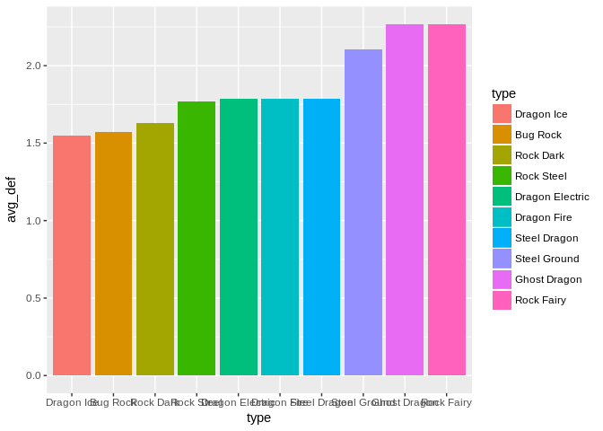
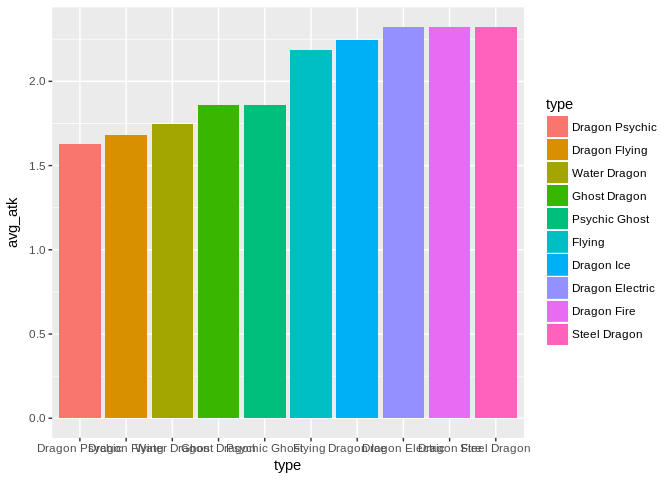

Pokemon Analysis
================
Evan Shui,Steven Taruc
2/17/2019

Import data / libraries
=======================

``` r
library(tidyverse)
```

    ## ── Attaching packages ─────────────────────────────────────────────────────────────────────────────────────── tidyverse 1.2.1 ──

    ## ✔ ggplot2 2.2.1     ✔ purrr   0.2.4
    ## ✔ tibble  1.4.1     ✔ dplyr   0.7.4
    ## ✔ tidyr   0.7.2     ✔ stringr 1.2.0
    ## ✔ readr   1.1.1     ✔ forcats 0.2.0

    ## ── Conflicts ────────────────────────────────────────────────────────────────────────────────────────── tidyverse_conflicts() ──
    ## ✖ dplyr::filter() masks stats::filter()
    ## ✖ dplyr::lag()    masks stats::lag()

``` r
pokes <- read.csv("https://www.dropbox.com/s/i0lwxgv86eaoq4o/pokemon.csv?dl=1")
```

Introduction
============

Pokemon is a game where each player has a set of characters, known as pokemon, that can be used to fight other pokemon. The ultimate goal is to beat all of your opponent's pokemon, getting their HP to 0, while keeping at least one of your pokemon alive. Thus, pokemon with greater stats, any of the fighting qualities that are covered by the Total column, are more desirable than other pokemon with lesser stats. The purpose of this report is to determine which pokemon type is better. Our metric used to determine the "better" pokemon is by calculating the Z-score and calculating it's average for each pokemon's fight qualities relative to the other pokemon in it's type. Our purpose is to find the pokemon(s) that are best suited for attacking and defending. We defined a pokemon that is best suited for attacking to be a pokemon that has great stats in speed, attack, and special attack. On the other hand, a pokemon that is best suited for defending is a pokemon that has great stats in defense, health, and special defense.

Analysis
========

First, we will be calculating the z-score of all the attributes. Given that we are only focusing on a pokemon's types and fight qualities, we don't need any of the other attributes provided in the data. We also create two new columns.

Here we are creating summarizing each pokemon's attacks by summing their attributes related to attacking such as special attack and speed. Same goes for its defense attributes. We then calculate the means of their overall attributes using the apply function.

``` r
data <- pokes %>%
  select(Type_1:Speed) %>%
  select(Total:Speed) %>%
  mutate(atk_tot = Attack + Sp_Atk + Speed) %>%
  mutate(def_tot = HP + Defense + Sp_Def)
mean_val <- data %>%
  select(Total: def_tot) %>%
  apply(2, mean)
mean_val
```

    ##     Total        HP    Attack   Defense    Sp_Atk    Sp_Def     Speed 
    ## 417.94591  68.38003  75.01387  70.80860  68.73786  69.29126  65.71429 
    ##   atk_tot   def_tot 
    ## 209.46602 208.47989

We then calculate the overall standard deviation of each variable from the means using the apply function.

``` r
std_val <- data %>%
  select(Total: def_tot) %>%
  apply(2, sd)
std_val
```

    ##     Total        HP    Attack   Defense    Sp_Atk    Sp_Def     Speed 
    ## 109.66367  25.84827  28.98448  29.29656  28.78801  27.01586  27.27792 
    ##   atk_tot   def_tot 
    ##  64.79195  62.40286

We then calculate the z-scores for each variable of each observation using the sweep function. The sweep function subtracts each column by its respective means. Therefore, we create a tempporary data set for observed - expected.

``` r
temp <- data %>%
  select(Total: def_tot)
no_mean <- sweep(data.matrix(temp), 2, mean_val)
```

``` r
z_score <- as.data.frame(sweep(data.matrix(no_mean), 2, std_val, '/'))
head(z_score, 10)
```

    ##         Total         HP     Attack    Defense     Sp_Atk     Sp_Def
    ## 1  -0.9113858 -0.9045103 -0.8975105 -0.7444082 -0.1298410 -0.1588423
    ## 2  -0.1180510 -0.3242007 -0.4489945 -0.2665364  0.3912093  0.3963871
    ## 3   0.9762038  0.4495454  0.2410301  0.4161377  1.0859431  1.1366929
    ## 4  -0.9934549 -1.1366341 -0.7940068 -0.9492105 -0.3035245 -0.7140717
    ## 5  -0.1180510 -0.4015753 -0.3799920 -0.4372049  0.3912093 -0.1588423
    ## 6   1.0582729  0.3721708  0.3100325  0.2454691  1.3985733  0.5814635
    ## 7  -0.9478609 -0.9431976 -0.9320117 -0.1982690 -0.6508914 -0.1958576
    ## 8  -0.1180510 -0.3628880 -0.4144933  0.3137365 -0.1298410  0.3963871
    ## 9   1.0217977  0.4108581  0.2755313  0.9964106  0.5648928  1.3217694
    ## 10 -2.0329970 -0.9045103 -1.5530338 -1.2222801 -1.6929921 -1.8245305
    ##          Speed    atk_tot     def_tot
    ## 1  -0.75937922 -0.7788934 -0.79291063
    ## 2  -0.20948392 -0.1152307 -0.08781471
    ## 3   0.52370981  0.8108103  0.87367972
    ## 4  -0.02618549 -0.5010811 -1.22558313
    ## 5   0.52370981  0.2243177 -0.44036267
    ## 6   1.25690354  1.2892649  0.52113176
    ## 7  -0.83269860 -1.0567057 -0.56856193
    ## 8  -0.28280330 -0.3621749  0.16858380
    ## 9   0.45039044  0.5638661  1.21020277
    ## 10 -0.75937922 -1.7666705 -1.73838016

We now have the z-score of all of the pokemon for the qualities. Now we will append the pokemon types.

``` r
z_score$Type_1 <- pokes$Type_1
z_score$Type_2 <- pokes$Type_2
head(z_score,10)
```

    ##         Total         HP     Attack    Defense     Sp_Atk     Sp_Def
    ## 1  -0.9113858 -0.9045103 -0.8975105 -0.7444082 -0.1298410 -0.1588423
    ## 2  -0.1180510 -0.3242007 -0.4489945 -0.2665364  0.3912093  0.3963871
    ## 3   0.9762038  0.4495454  0.2410301  0.4161377  1.0859431  1.1366929
    ## 4  -0.9934549 -1.1366341 -0.7940068 -0.9492105 -0.3035245 -0.7140717
    ## 5  -0.1180510 -0.4015753 -0.3799920 -0.4372049  0.3912093 -0.1588423
    ## 6   1.0582729  0.3721708  0.3100325  0.2454691  1.3985733  0.5814635
    ## 7  -0.9478609 -0.9431976 -0.9320117 -0.1982690 -0.6508914 -0.1958576
    ## 8  -0.1180510 -0.3628880 -0.4144933  0.3137365 -0.1298410  0.3963871
    ## 9   1.0217977  0.4108581  0.2755313  0.9964106  0.5648928  1.3217694
    ## 10 -2.0329970 -0.9045103 -1.5530338 -1.2222801 -1.6929921 -1.8245305
    ##          Speed    atk_tot     def_tot Type_1 Type_2
    ## 1  -0.75937922 -0.7788934 -0.79291063  Grass Poison
    ## 2  -0.20948392 -0.1152307 -0.08781471  Grass Poison
    ## 3   0.52370981  0.8108103  0.87367972  Grass Poison
    ## 4  -0.02618549 -0.5010811 -1.22558313   Fire       
    ## 5   0.52370981  0.2243177 -0.44036267   Fire       
    ## 6   1.25690354  1.2892649  0.52113176   Fire Flying
    ## 7  -0.83269860 -1.0567057 -0.56856193  Water       
    ## 8  -0.28280330 -0.3621749  0.16858380  Water       
    ## 9   0.45039044  0.5638661  1.21020277  Water       
    ## 10 -0.75937922 -1.7666705 -1.73838016    Bug

Here we calculate the average total attack Z-score of each pokemon type.

``` r
avg_atk <- z_score %>%
  group_by(Type_1, Type_2) %>%
  summarize(avg_atk = mean(atk_tot)) %>%
  arrange(desc(avg_atk))
avg_atk$type <- paste(avg_atk$Type_1, avg_atk$Type_2)
head(avg_atk, 10)
```

    ## # A tibble: 10 x 4
    ## # Groups:   Type_1 [6]
    ##    Type_1  Type_2   avg_atk type           
    ##    <fctr>  <fctr>     <dbl> <chr>          
    ##  1 Dragon  Electric    2.32 Dragon Electric
    ##  2 Dragon  Fire        2.32 Dragon Fire    
    ##  3 Steel   Dragon      2.32 Steel Dragon   
    ##  4 Dragon  Ice         2.25 Dragon Ice     
    ##  5 Flying  ""          2.18 "Flying "      
    ##  6 Ghost   Dragon      1.86 Ghost Dragon   
    ##  7 Psychic Ghost       1.86 Psychic Ghost  
    ##  8 Water   Dragon      1.74 Water Dragon   
    ##  9 Dragon  Flying      1.68 Dragon Flying  
    ## 10 Dragon  Psychic     1.63 Dragon Psychic

Here we calculate the average total defense Z-score of each pokemon type.

``` r
avg_def <- z_score %>%
  group_by(Type_1, Type_2) %>%
  summarize(avg_def = mean(def_tot)) %>%
  arrange(desc(avg_def))
avg_def$type <- paste(avg_def$Type_1, avg_def$Type_2)
head(avg_def, 10)
```

    ## # A tibble: 10 x 4
    ## # Groups:   Type_1 [5]
    ##    Type_1 Type_2   avg_def type           
    ##    <fctr> <fctr>     <dbl> <chr>          
    ##  1 Ghost  Dragon      2.27 Ghost Dragon   
    ##  2 Rock   Fairy       2.27 Rock Fairy     
    ##  3 Steel  Ground      2.11 Steel Ground   
    ##  4 Dragon Electric    1.79 Dragon Electric
    ##  5 Dragon Fire        1.79 Dragon Fire    
    ##  6 Steel  Dragon      1.79 Steel Dragon   
    ##  7 Rock   Steel       1.77 Rock Steel     
    ##  8 Rock   Dark        1.63 Rock Dark      
    ##  9 Bug    Rock        1.57 Bug Rock       
    ## 10 Dragon Ice         1.55 Dragon Ice

Here is a plot displaying the top 10 pokemon types with the highest Z-score in average total defense.

``` r
avg_def$type <- factor(avg_def$type, levels = avg_def$type[order(avg_def$avg_def)])

avg_def %>%
  arrange(desc(avg_def)) %>%
  head(10) %>%
  ggplot(aes(x = type, y=avg_def, fill=type)) + geom_col()
```

 Here is a plot displaying the top 10 pokemon types with the highest Z-score in average total attack

``` r
avg_atk$type <- factor(avg_atk$type, levels = avg_atk$type[order(avg_atk$avg_atk)])

avg_atk %>%
  arrange(desc(avg_atk)) %>%
  head(10) %>%
  ggplot(aes(x = type, y=avg_atk, fill=type)) + geom_col()
```



Conclusion
==========

Given these two graphs, it seems like if the best pokemon for defense would be a pokemon of Rock Fairy or Ghost Dragon types while the best pokemon for attack would be a pokemon of the Steel Dragon, Dragon Fire, or Dragon Electric type. Here we can see that the Rock Fairy and the Ghost Dragon types have a Z-score of 2.267846648 for defense based stats out of all the pokemon. On the other hand, steel dragon, Dragon Fire, and Dragon Electric types have a Z-score of 2.323343984. We also noticed that majority of the top tier pokemons are "Dragon types". Thus, we can conclude that a having a team of pokemon with these 5 types would maximize the potential of winning battles against other players.
